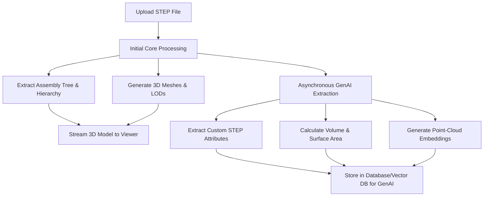

# CAD Metadata & Geometric Data Extraction for GenAI

This document outlines what data is extracted from CAD models, what can be extracted, and recommendations for GenAI-ready data extraction.

---

## 1. Data Extracted Currently

The pipeline extracts both structural tree data and 3D visual data for high-performance streaming.

| Extracted Data | Description |
| :--- | :--- |
| **Assembly Hierarchy** | Structural parent-child relationships within the assembly. |
| **Node / Part Names** | Descriptive names of individual components extracted from the STEP file. |
| **Transform Matrices** | `4x4` orientation and translation vectors for instance placement. |
| **Spatial Bounding Boxes** | Spatial minimum and maximum bounds defining the size of each component. |
| **3D LOD Meshes** | Mesh exports at 3 Levels of Detail (LOD0, LOD1, LOD2) as GLB chunks. |

---

## 2. Advanced Data Extraction (Future Expansion)

To unlock deep analytical capabilities for Generative AI, we can extract the following additional data points from CAD models:

### A. Near-Instant Extraction (No computational slowdown)
- **Colors & Styles**: Original RGB values and transparency profiles.
- **Advanced Attributes**: Custom metadata (Part Numbers, Supplier Info, Custom Properties).
- **Calculated Human-Readable Dimensions**: Converting bounding boxes into physical `Length x Width x Height` strings.

### B. Math-Based Geometry Analysis (Minor computational cost)
- **Mass Properties**: Accurate volume, surface area, and mass density per component.
- **Center of Mass**: Finding the geometric centroid of parts to enable physical/structural reasoning.

### C. Advanced Machine Learning Data (Requires higher compute)
- **Automatic 2D Renders/Projections**: Isometric screenshots of the assembly and sub-parts for multimodal GenAI analysis.
- **Surface Point Cloud Embeddings**: Point sampling for vector database searches (e.g., in Qdrant) to allow geometric similarity matching.

---

## 3. Recommended Implementation Strategy

To prevent visual streaming delays when extracting complex GenAI-ready metadata, the following workflow is recommended:

1. **Prioritize Streaming First**: Extract visual meshes and basic assembly structures immediately so the model renders in the front-end within seconds.
2. **Asynchronous Background Calculations**: Offload compute-heavy metadata, mass properties, and vector embeddings to a secondary background worker queue.
3. **Save and Notify**: Store GenAI metadata in the database once complete, without slowing down the initial user experience.
