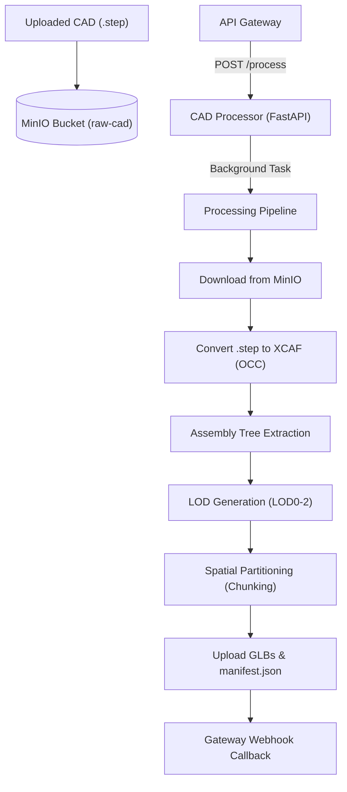

# CAD Processing & Streaming Architecture Documentation

## 1. Overview
This document outlines the architecture, pipeline, and trade-offs of the `cad-processor` service within the Forgetwin-AI monorepo. It serves as a guide for understanding how heavy CAD assemblies are converted into streamable chunks.

---

## 2. Core Architecture
The `cad-processor` is built using a lightweight **FastAPI** Python application that integrates with **MinIO** for storage, **pythonocc-core** for geometric processing, and **trimesh** for serialization.

---

## 3. Pipeline Stages & Implementation Details
1. **File Ingestion & Parsing**: Background tasks execute asynchronous downloads directly from the raw MinIO bucket.
2. **High-Fidelity Hierarchy Extraction**: The core reads the assembly tree structure via OpenCASCADE’s `XCAFDoc_DocumentTool`.
3. **Multi-tier LOD Meshing**:
   - **LOD0**: High Detail (Deflection `0.05`)
   - **LOD1**: Medium Detail (Deflection `0.5`)
   - **LOD2**: Low Detail (Deflection `5.0`)
4. **Spatial Sort & Chunking**: To optimize performance, the process performs sequential spatial grouping along the X-axis (`CHUNK_SIZE = 200` parts).
5. **Manifest Generation**: Saves a light `manifest.json` describing bounding boxes and references for on-demand streaming.

---

## 4. Architectural Comparison

### Primary Core Engine
- **Enterprise CAD Companies**: Native C++ Kernel using heavy commercial or open-source kernels like Parasolid, ACIS, or OCCT.
- **Our Implementation**: Hybrid Python + C++ where Python (`FastAPI`) orchestrates tasks and C++ bindings (`pythonocc-core`) handle geometries.

### Assembly Parsing & Processing
- **Enterprise CAD Companies**: Multi-threaded C++ / Rust Workers with fine-grained CPU and RAM control.
- **Our Implementation**: Python Background Tasks using async/threading workers to process raw STEP files.

### Spatial Partitioning (Chunking)
- **Enterprise CAD Companies**: Dynamic BVH / 3D Octree clustering using Octrees/KD-Trees to separate spatial data cleanly.
- **Our Implementation**: Simple 1D Spatial Sort along the X-axis (`CHUNK_SIZE = 200`) to group geometries sequentially.

### Level of Detail (LOD) Generation
- **Enterprise CAD Companies**: Edge Collapse Mesh Simplification using sophisticated decimation algorithms without losing topology.
- **Our Implementation**: Deflection Adjustment modifying linear parameters in OpenCASCADE to vary resolution.

### Frontend Streaming & Rendering
- **Enterprise CAD Companies**: WebGPU / Highly Compressed Custom Format tailored for rapid network transmission.
- **Our Implementation**: WebGL (Three.js) & glTF (.glb) fetching standard binaries via a ChunkManager.

### Task & Job Queue Management
- **Enterprise CAD Companies**: Distributed Brokers like Kafka, RabbitMQ, or SQS with auto-scaling instances.
- **Our Implementation**: In-memory Background Queue built into FastAPI instances running on a single host.

---

## 5. Pros & Cons of the Current Approach

### **Pros**
* **Rapid Iteration**: Features can be added, tested, and shipped quickly using FastAPI.
* **Low Maintainability Burden**: Requires no local C++ toolchains or cross-platform compilation.
* **Fallback Simulation**: Mock mode ensures normal development without specialized CAD engines.

### **Cons**
* **Scale Limitations**: Massive industrial assemblies (thousands of distinct parts) may hit memory limitations.
* **Simple Spatial Partitioning**: The 1D X-axis sort may result in larger overlapping bounds compared to an Octree.
* **In-memory Queuing**: Relies on host-level background queues, creating a vulnerability if instances crash or reboot.

---

## 6. Which Implementation is Best?

### **When Our Implementation is Best:**
* **Startups & MVPs**: Ideal for testing features like assembly tree extraction and spatial chunking without native C++ build overhead.
* **Rapid Prototyping**: Fast turnaround time and quick iterations using built-in testing mocks.
* **Budget Constrained**: Requires less specialized development talent and minimal maintenance costs.

### **When the Enterprise Approach is Best:**
* **Heavy Scale Workloads**: Processing large assemblies (millions of triangles or tens of thousands of sub-assemblies).
* **High Performance & Optimization**: Fine-grained control over memory management and computational performance.
* **High Production Load**: Needs strong queue durability (Celery, Kafka, SQS) and zero data loss on service reboots.

---

## 7. Packaging as an Executable (.exe) vs. Containers

Converting the Python-based CAD processor into a standalone executable can be highly beneficial or unnecessary depending on your target deployment environment.

### **When Making an `.exe` is Best:**
* **On-Premises / Desktop Distributions**: Simplifies setup for Windows environments where users do not have Python installed.
* **Stand-alone Deployment**: Packages all native C++ OpenCASCADE DLLs and wrappers into a single executable using tools like PyInstaller or Nuitka.

### **When Using Containers (Docker) is Best:**
* **Cloud Infrastructure**: Scalable environments like Kubernetes or AWS ECS rely on containers to manage runtime dependencies effortlessly.
* **Avoid Complex DLL Compilation**: Native binaries and dependencies link cleanly inside localized containers, avoiding extraction issues during software startup.
