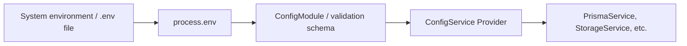

# Configuration and Environment Management Notes

## 1. Direct Comparison

| Feature | Raw `process.env` | NestJS `ConfigService` |
| :--- | :--- | :--- |
| **Origin** | Comes directly from your OS environment variables or `.env` files via `dotenv`. | Reads the data directly from `process.env`. |
| **Validation** | ❌ None. You can read any undefined or typo-prone key without a warning. | ✅ Strict. It validates the keys and their types against a schema (e.g., via Zod) before your app boots. |
| **Type-Safety** | ❌ None. All environment variables in Node are returned as strings or undefined. | ✅ High. You can safely type-cast with generics like `configService.get<string>('KEY')`. |
| **Availability** | Accessible anywhere globally via standard Node runtime. | Safely accessible anywhere in NestJS via constructor dependency injection. |
| **Caching** | Direct runtime lookups (accessing it repeatedly is slightly slower). | Highly optimized since NestJS parses and caches it in memory during start up. |

---

## 2. The Operational Chain

### Flow Breakdown

1. **OS Environment Loading:** The operating system or local runtime pulls keys/values from system variables or a `.env` file into Node's memory as `process.env`.
2. **Schema Validation:** Upon start up, NestJS's `ConfigModule.forRoot` intercept `process.env` using your defined Zod schema (`env.validation.ts`).
3. **Registration & Injection:** If valid, these values are stored in a secure singleton service (`ConfigService`), which can be safely injected across any file/module.
4. **App Execution:** Services use `configService.get('VARIABLE')` to fetch pre-validated and typed configuration settings without interacting with `process.env` directly.
